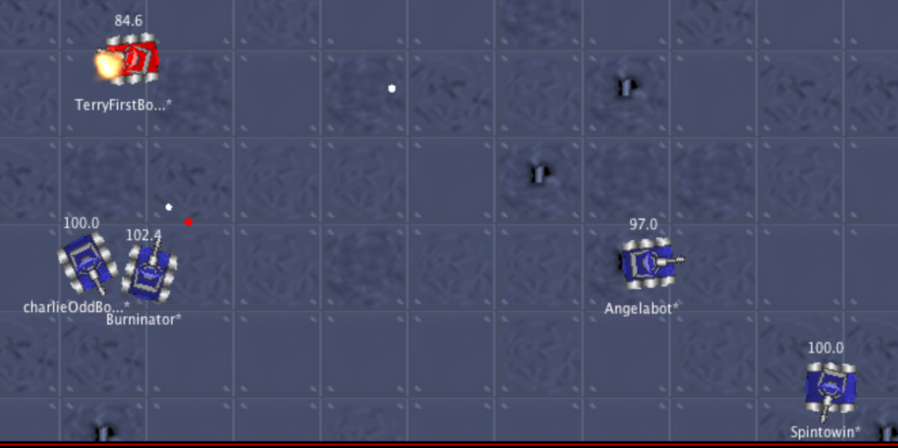

# scootbattlebots
Robocode Battle Bots, in Kotlin
-----

This repo contains robots for the programming battling game [Robocode](https://robocode.sourceforge.io/).

Started way back in 2001, Robocode was built to teach Java using a fun 2D bot battling game. Turns out it can be hacked and dented a little bit so bots can be written in Kotlin.

Note: the instructions below use Java 8, but it works with Java 12 and maybe ought to be using that.   

Setup
---

- Install Intellij + JDK (if you actually need to)
  - Download [IntelliJ Community](https://www.jetbrains.com/idea/download/#section=mac)
  - `brew tap adoptopenjdk/openjdk`
  - `brew cask install adoptopenjdk/openjdk/adoptopenjdk8`
  - Set up [jenv](https://developer.bring.com/blog/configuring-jenv-the-right-way/) for managing multiple JVM versions
  - `jenv add /path/to/jdk8` (should be `/Library/Java/JavaVirtualMachines/adoptopenjdk-8.jdk/Contents/Home`)

- Install Robocode
  - Download [latest](https://sourceforge.net/projects/robocode/files/robocode/) setup jar (not the testing jar)
  - Install to a directory of choice (I used `~/code/kotlin/robocode`)

- Clone this repo (you can create an IntelliJ project directly from the GitHub link)

- File > Project Structure
    - Modules on left side
      - Sources tab
        - Delete the default sources folder (`src/`)
        - Make sure the `bots/` folder is added as a source folder instead (You should see it listed in blue on the right) 

      - Dependencies tab
          - Make sure you have the `KotlinJavaRuntime` as a dependency
          - Click the plus sign at bottom left, choose JARs and add  `<robocode install dir>/libs/robocode.jar`

- You should now be able to build the project
  - Build > Build Project or CMD + F9
  
If your bot `import robocode.*`, and you subclass either `Robot` or `AdvancedRobot`, IntelliJ autocompletion will work for all the Robocode classes and methods, which is pretty cool. See `/bots/src` for examples. ~Sourcecode sportsmanship applies!~

Running
----

- Launch the Robocode game itself by running `<robocode install dir>/robocode.sh`
- Options > Preferences > Development options tab
- Click `Add` and navigate to the battlebots repo (*NOT* the Robocode installation directory) and add `out/production/scootbattlebots` to the classpath
- Battle > New or CMD+N to start a new battle. You should see your bots and others' in the packages on the left.
- Add and remove contenders to the Selected Robots on the right
- The Rules tab will let you change the battlefield size and other various constants, such as the total number of rounds for the battle.
- Hit the Start Battle button at the bottom 

Keep Going
----

- [API Docs](https://robocode.sourceforge.io/docs/robocode/)
- a series of [tutorials](http://mark.random-article.com/weber/java/robocode/) (feel free to skip to #2)
- The [Robocode Wiki](http://www.robowiki.net/), but it might be down?